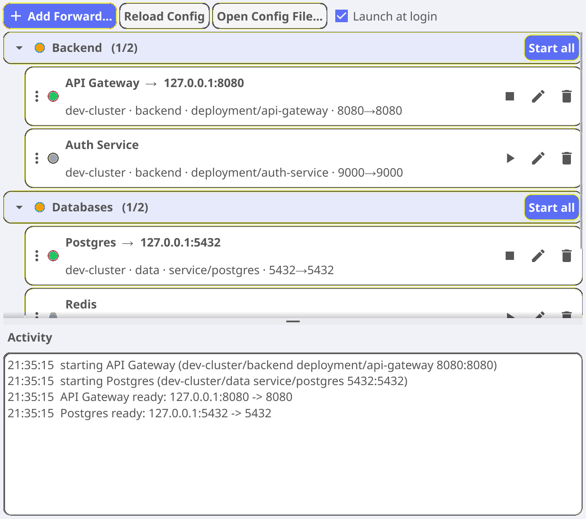
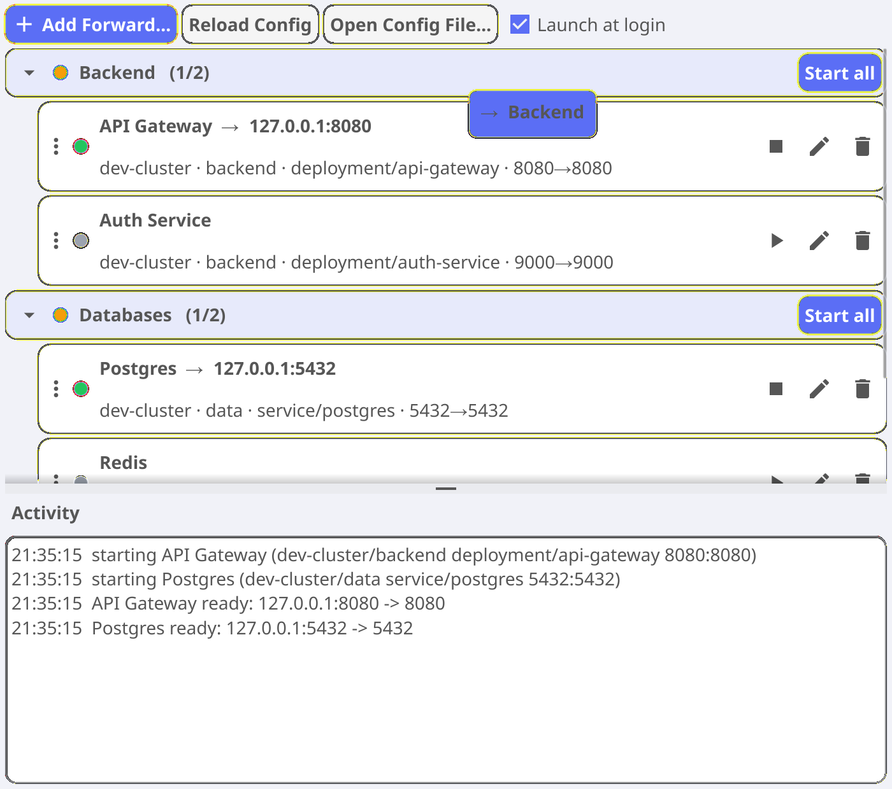
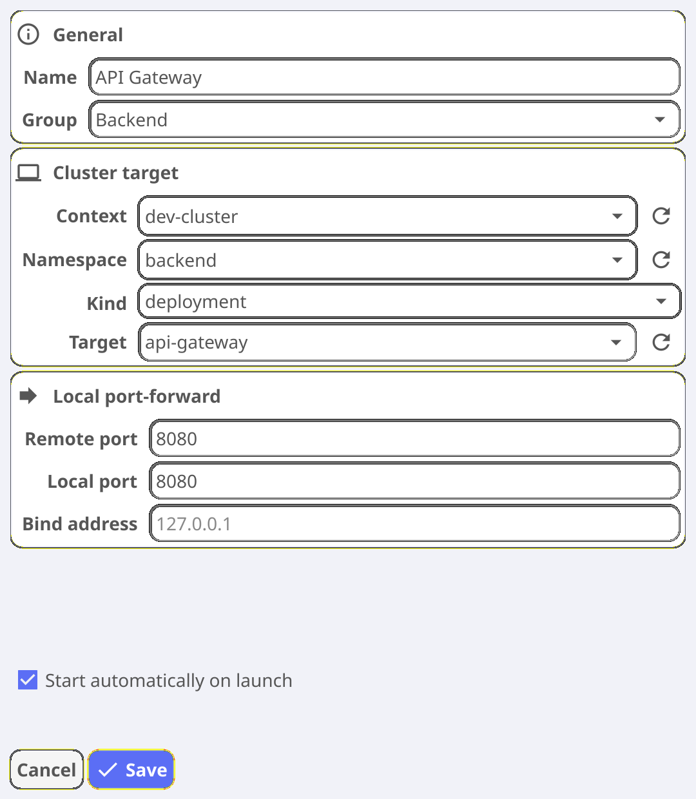

# k8s-tray-forwarder — User Guide

A macOS menu-bar app for turning Kubernetes port-forwards on and off without
living in a pile of `kubectl port-forward` terminal tabs. Configure the
services you reach often once, then start and stop them from the menu bar (or
let them come up automatically at login).

Under the hood every forward is a supervised `kubectl port-forward` process, so
whatever authentication already works on your command line — including EKS
`aws eks get-token` and other exec-credential plugins — works here too. There
are no separate credentials to manage.

This guide covers day-to-day use. For installation, building, and release
details see the [project README](../README.md).

## Contents

- [Installing and launching](#installing-and-launching)
- [Concepts](#concepts)
- [The Manage window](#the-manage-window)
- [Groups](#groups)
- [Drag a forward into a group](#drag-a-forward-into-a-group)
- [Adding and editing a forward](#adding-and-editing-a-forward)
- [Start at launch and launch at login](#start-at-launch-and-launch-at-login)
- [The config file](#the-config-file)
- [Troubleshooting](#troubleshooting)
- [How it works](#how-it-works)

## Installing and launching

```sh
brew install --cask laszukdawid/tap/k8s-tray-forwarder
```

Launch **K8s Port Forwards** from Spotlight, Launchpad, or `/Applications`. The
app has no dock window — it lives entirely in the menu bar. Click its icon to
open the menu; from there you can toggle forwards, add a new one, or open the
**Manage Forwards** window described below.

Requirements: `kubectl` on your `PATH` with a working kubeconfig. See the
[README](../README.md#requirements) for the full list and for building from
source.

## Concepts

- **Forward** — one toggleable `kubectl port-forward`. It names a cluster
  target (context, namespace, kind, resource name) and a port mapping
  (`localPort → remotePort`) bound to a local address.
- **Group** — an optional label that clusters related forwards so you can flip
  them on and off together, e.g. everything you need for your "Backend" stack.
  Forwards with no group are shown on their own, alongside the groups.
- **Status** — a forward is *stopped*, *starting*, *running*, *reconnecting*,
  or *error*. Running forwards that drop out (pod rescheduled, token refresh, a
  network blip) reconnect on their own with backoff until you stop them.

## The Manage window

Open it from the menu bar (**Manage Forwards…**). This is the main screen: a
card per forward, grouped where you've assigned groups, with a live activity
log underneath.



Each forward card shows:

- **A status dot** — 🟢 green running, ⚪ grey stopped, 🟡 amber
  starting/reconnecting, 🔴 red error.
- **Title** — the forward's name, plus `→ 127.0.0.1:<port>` once it's running.
- **Connection summary** — `context · namespace · kind/target · local→remote`.
- **Actions on the right** — ▶/⏹ start or stop, ✎ edit, 🗑 delete.
- **A grip (⋮) on the left** — drag it to move the forward into a group (see
  [below](#drag-a-forward-into-a-group)).

The header row carries **Add Forward…**, **Reload Config** (re-reads the file
from disk so hand-edits take effect), **Open Config File…** (reveals the YAML in
your default editor), and the **Launch at login** checkbox.

The **Activity** log at the bottom records every start, stop, ready, and
disconnect with a timestamp — handy for seeing *why* a forward is retrying.

Starting or stopping a single forward is just its ▶/⏹ button. The same toggles
are also available directly from the menu-bar menu, so a forward you reach for
constantly is one click away without opening this window.

## Groups

A group is drawn as a tinted header card you can collapse or expand with the
chevron on its left. The header shows an aggregate status dot and a
`running / total` count (e.g. `Backend (1/2)`), and a **Start all / Stop all** button
that flips every member at once — *Start all* brings up the ones that aren't
running yet and leaves the rest alone; once everything is up it becomes *Stop
all*.

Collapse a group to tuck its members away behind the header (the header's dot
and count still tell you what's running); expand it to start, stop, edit, or
delete members individually.

Groups also appear in the menu-bar menu as submenus, each with its own **Start
all / Stop all** plus per-member toggles — so you can bring up a whole
environment from the menu bar without opening the Manage window.

## Drag a forward into a group

To move a forward into an existing group, grab its **⋮** handle and drag the row
onto the group's header. A hint badge follows the cursor and shows the group
you're about to drop into; release over the header to reassign it.



The forward is reassigned and saved immediately, and the destination group
expands so you can see it land. Dropping anywhere that isn't a group header does
nothing. To *remove* a forward from its group, edit it and clear the **Group**
field.

## Adding and editing a forward

Click **Add Forward…** (menu bar or Manage window) to create one, or the ✎
button on a card to edit it. The window is organized into three sections:



- **General** — the display **Name** and an optional **Group**. The Group field
  suggests groups you already use, or you can type a new one.
- **Cluster target** — **Context**, **Namespace**, **Kind**
  (deployment / service / pod), and **Target**. The **↻** button beside a field
  fetches its live choices from the cluster.
- **Local port-forward** — **Remote port** (the port on the target),
  **Local port** (what you bind locally; defaults to the remote port), and
  **Bind address** (defaults to `127.0.0.1`).

Below the sections, **Start automatically on launch** brings this forward up
whenever the app starts.

A couple of behaviors worth knowing:

- **Adding** walks you through the cluster top-down: pick a context and the
  namespaces load, pick a namespace and the targets load. When you choose a
  target, its declared port prefills **Remote port** for you.
- **Editing** opens instantly with the saved values and makes *no* cluster
  calls — it just shows what you already have. Use the **↻** buttons only when
  you actually want to change the context, namespace, or target and need fresh
  choices. This keeps editing fast even when a context is slow to authenticate.

## Start at launch and launch at login

Two independent switches:

- **Start automatically on launch** (per forward) — set on a forward so it comes
  up as soon as the app runs. In YAML this is `autoStart: true`.
- **Launch at login** (whole app) — the checkbox in the Manage window installs a
  macOS LaunchAgent so the app itself starts when you log in. In YAML this is
  `launchAtLogin: true`.

Combine them to have specific forwards live the moment you sit down at your Mac.

> For launch-at-login to point at a stable path, enable it from the installed
> `.app` (not from `task run`) — the LaunchAgent records whichever executable
> started the app.

## The config file

Everything the UI does is stored in a YAML file, and the UI reads and writes
that same file — so you can hand-edit it and hit **Reload Config**, or let the
windows manage it for you.

Location:

```
~/Library/Application Support/k8s-tray-forwarder/config.yaml
```

Override it with `K8S_TRAY_FORWARDER_CONFIG=/path/to/config.yaml`. A file with
two grouped forwards and one standalone:

```yaml
launchAtLogin: true          # start the app itself at login (LaunchAgent)

forwards:
  - name: API Gateway
    group: Backend           # forwards sharing a group toggle together
    type: kubernetes
    context: dev-cluster
    namespace: backend
    targetKind: deployment   # deployment | service | pod
    targetName: api-gateway
    remotePort: 8080
    localPort: 8080          # optional; defaults to remotePort
    autoStart: true          # bring this one up when the app launches

  - name: Auth Service
    group: Backend
    type: kubernetes
    context: dev-cluster
    namespace: backend
    targetKind: deployment
    targetName: auth-service
    remotePort: 9000
    localPort: 9000

  - name: Grafana           # no group → shown on its own
    type: kubernetes
    context: dev-cluster
    namespace: observability
    targetKind: service
    targetName: grafana
    remotePort: 3000
    localPort: 3000
    address: 127.0.0.1      # optional local bind address
```

| Field | Meaning |
| --- | --- |
| `name` | Label shown in the menu and windows. |
| `group` | Optional. Clusters related forwards; omit to show a forward on its own. |
| `type` | Always `kubernetes` today. |
| `context` | kubeconfig context name. |
| `namespace` | Target namespace. |
| `targetKind` | `deployment`, `service`, or `pod`. |
| `targetName` | Resource name to forward to. |
| `remotePort` | Port on the target. |
| `localPort` | Local port to bind. Optional — defaults to `remotePort`. |
| `address` | Local bind address. Optional — defaults to `127.0.0.1`. |
| `autoStart` | Start this forward when the app launches. |

`id` is assigned automatically and can be omitted from hand-written entries. See
[`config.example.yaml`](../config.example.yaml) for a fully commented file.

## Troubleshooting

- **A forward shows red / keeps retrying.** Expand its group (or find its card)
  and read the error under the connection summary, and the fuller message in the
  **Activity** log. It's usually the underlying `kubectl` failing — an expired
  context, a missing namespace, or a target that no longer exists. Fixing the
  cluster side and leaving the forward on is enough; it retries on its own.
- **Nothing loads in the Add window, or you see an auth error.** The app runs
  your `kubectl`, so the same command failing in a terminal will fail here.
  Confirm `kubectl config get-contexts` works and that any SSO/exec login is
  current, then reopen the window or use the **↻** buttons.
- **The menu bar isn't showing running state you expect.** Use **Reload Config**
  after hand-editing the YAML; the app doesn't watch the file automatically.
- **Local port already in use.** Two forwards can't bind the same `localPort` on
  the same address at once — give one of them a different local port.

## How it works

- **Discovery and forwarding go through your local `kubectl`.** Listing
  contexts/namespaces/targets and running the forward are all `kubectl`
  subprocesses, so the app inherits your existing auth and needs no extra
  configuration.
- **Each active forward is supervised.** A background loop launches
  `kubectl port-forward`, watches it, and relaunches it with exponential backoff
  if it exits unexpectedly — until you switch the forward off.
- **The config is a plain YAML file** you fully own; the UI is just a convenient
  editor and runner for it.

For source layout, packaging, and releasing, see the
[project README](../README.md).
